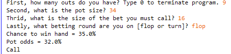
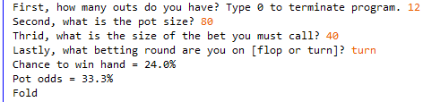

# PokerCalculator.java
## What problem does this program solve?

Picture this, you're playing a poker hand with your friends and are dealt 2 pocket clubs. The flop contains 2 additional clubs and your heart starts pumping, your chasing a flush draw! However, your opponent called the villain, is not going to let you see cards for free, and bets $5 dollars to make the total pot $20 dollars. The decision is yours, do you fold, call or raise?

## How fish process this decision. 
I just need 1 more card to hit my draw. I'm calling every time!

## How sharks (and PokerCalculator.java) process this decision. 
#### First, identify the number of outs to calculate the chance to win.

A flush draw means you have 9 outs (13 suited cards - 4 displayed) that will improve your hand. On the flop you multiple your outs by 4 so the chance to hit a club is 9 * 4 = 36%.

#### Second, determine the pot odds. Formula: Pot odds = 100 / (pot / bet + 1).

You face a $5 bet into a $20 dollar pot. Take the $20 pot and divide it by the required bet (20 / 5 = 4) then add 1 (your bet if you call), making your odds (4 + 1 = 5). Divide 100 by your odds to determine the pot odds (100 / 5 = 20%).

#### Compare the values from steps 1 and 2.

Chance to win hand = 36%

Pot Odds = 20%

Since your chance to win is greater than the pot odds, you CALL.

If your chance to win is less than the pot odds, you FOLD or raise.

## 10,000 Foot Overview
Poker is complex and decisions are not black and white. Strictly speaking, calling the flop at 4(outs) odds and folding every time you miss the out on the turn is negative expected value (-EV). However, it is important to remember that you can still win the pot EVEN if you miss your out. Poker strategy concepts such as fold equity, implied odds, hand ranges and the tendencies of the villain are impossible to quantify, but positively contribute to your EV. This is why the formula encourages taking more risk on the flop compared to the turn.

Every street, you face 3 options - fold, check/call and raise. The more options you consider, the greater chance to make a mistake. You should limit the number of choices. Take the above example, you have correct pot odds to call 36% to 20%, the fold option is a mistake and the raise option is not optimal. Why raise yourself out of profitable decision? Just call.

Take the opposite example, say you have incorrect pot odds, 22% chance to win with 28% pot odds. The fold option is correct to protect your chip stack from -EV plays. The call option is a mistake. However, the raise option is an acceptable play in certain scenarios. This is a semi-bluff that combines the poker concepts highlighted above with your chance to win hand to estimate a +EV play (and disguise your hand range) even in the face of incorrect pot odds. In summary, never call incorrect pot odds, fold or raise are your only 2 options.

## Misc
1/14/2021 Update: calculateChanceToWinHand method changed when outs >= 8 to more precisely calculate the chance to improve your hand when you have many outs.

This software requires the player to use their skill and experience to recognize how many outs will improve their hand. Additionally, this software makes use of game state information that is openly available to everyone at the table such as pot size, betting information and current street. This software takes no action by itself and requires the player to make the final decision to fold, call, raise and determine an appropriate bet sizing. Before using this software, one should consult the rules and regulations of their cardroom to determine if the spirit of this software falls under the cardroom's permitted tools and services guidelines.

Project inspired by: http://www.pokerprofessor.com/university/how-to-win-at-poker/poker-math
